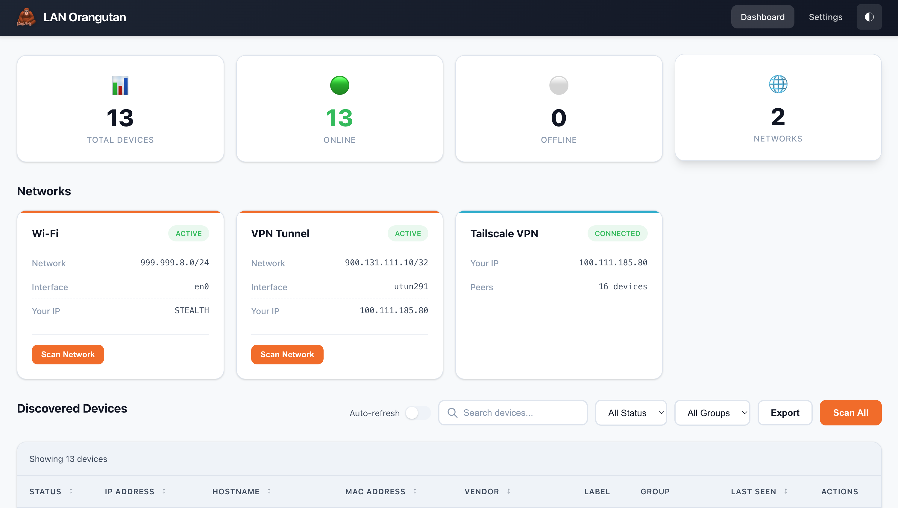
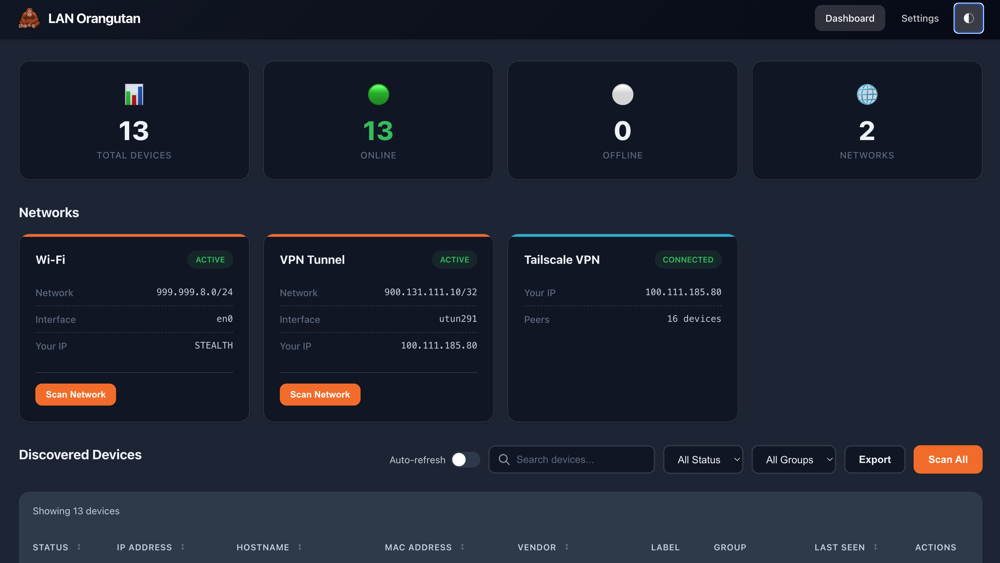

# 🦧 LAN Orangutan

<p align="left">
  &nbsp;&nbsp;
    &nbsp;&nbsp;
  &nbsp;&nbsp;
  &nbsp;&nbsp;
  
</p>

**Self-hosted network discovery for homelabbers.**

Scan your networks, discover devices, label and track them - all from a clean web UI or CLI.

By [291 Group](https://291group.com)

<p align="center">
  
  
</p>

## Features

🔍 Auto-discover devices using nmap<br>
🏷️ Label, group, and add notes to devices<br>
🌐 Multi-network support<br>
🔗 Tailscale integration - tailnet peers discovered automatically<br>
📊 Live scan progress you can cancel<br>
💻 Modern web dashboard with light/dark mode<br>
⌨️ Full CLI with JSON output<br>
🍎 Cross-platform (Linux, macOS, Windows)<br>
📦 Single binary, no dependencies<br>

## Quick Start

### Download

Grab the latest release of LAN Orangutan for your platform from [GitHub Releases](https://github.com/291-Group/LAN-Orangutan/releases).

### Run

```bash
# Linux/macOS - Run with sudo for full device info (MAC addresses, vendors)
sudo ./orangutan serve

# Windows (run as Administrator for full device info)
orangutan.exe serve
```

Open `http://localhost:291` in your browser.

## Requirements

- **nmap** must be installed:
  - macOS: `brew install nmap`
  - Ubuntu/Debian: `sudo apt install nmap`
  - Windows: Download from nmap.org

## CLI Usage

```bash
# Scan network (use sudo for MAC addresses and vendor info)
sudo orangutan scan                    # Scan default network
sudo orangutan scan 192.168.1.0/24     # Scan specific network
sudo orangutan scan all                # Scan all detected networks

# Start web server
sudo orangutan serve                   # Default port 291
sudo orangutan serve --port 8080       # Custom port

# List devices
orangutan list                         # List all devices
orangutan list --online                # List online devices only
orangutan list --format json           # JSON output

# Export
orangutan export devices.csv           # Export to CSV

# Check status
orangutan status                       # Show system status
orangutan version                      # Show version info
```

### Why sudo?

Running with `sudo` (or as Administrator on Windows) allows nmap to:
- Read the ARP table to get MAC addresses
- Look up device vendors from MAC addresses
- Get more accurate hostname resolution

Without elevated privileges, you'll still see device IPs but MAC addresses and vendors will be missing.

## Web Dashboard

The web dashboard provides:
- Real-time device status (online/offline)
- Device grouping (Server, Desktop, Laptop, Mobile, IoT, etc.)
- Labels and notes for each device
- Search and filter devices
- Export to CSV/JSON
- Auto-refresh option
- Keyboard shortcuts (/ to search, R to refresh, T to toggle theme)

### Scan progress

Scans run in the background, so the dashboard stays responsive and a long scan
will not time out. Progress shows which network is being scanned, how many
devices have been found, and a time estimate based on how long that network took
to scan last time. Scanning a large network takes a few minutes, and you can
cancel at any point.

The first scan of a network has no previous timing to estimate from, so it shows
elapsed time instead of a percentage.

## Tailscale

Tailscale devices are picked up automatically: if Tailscale is connected, its
peers are added to your device list alongside the machines found on your local
networks.

Tailscale peers cannot be found by scanning, because Tailscale gives every node
its own single-address network, leaving no range to sweep. Instead the peers are
read from Tailscale itself, which is faster and needs no elevated privileges.

Only peers that are currently online are listed, and they are shown with their
Tailscale hostname and operating system. Peers have no MAC address, so no
hardware vendor is looked up for them.

## Configuration

Config file location:
- Linux: `~/.config/lan-orangutan/config.ini` or `/etc/lan-orangutan/config.ini` (as root)
- macOS: `~/Library/Application Support/lan-orangutan/config.ini`
- Windows: `%APPDATA%\lan-orangutan\config.ini`

See `config.example.ini` for available options.

## Building from Source

```bash
git clone https://github.com/291-Group/LAN-Orangutan.git
cd LAN-Orangutan
go build -o orangutan ./cmd/orangutan
```

## License

MIT License

---

Built with ❤️ by [291 Group](https://291group.com)
